# 👋 Hi, I'm Gansen!

I am a **PhD in Statistics**. My PhD research focused on developing statistical learning methods for self-reported data, with applications to chronic pain research. My academic journey has equipped me with a strong foundation in **statistical theory**, **machine learning**, and **data analysis**—skills I’m excited to apply to real-world challenges in industry.

Throughout my research, I’ve worked on:
- 🧠 **Clustering** and **metric learning**
- 🏷️ **Multi-label classification**
- 🔬 Simulation studies and modeling with complex error structures
- 📊 Working with noisy, self-reported, and high-dimensional data

These experiences have sharpened my analytical thinking and programming proficiency in languages such as **R** and **Python**.

I’m passionate about turning data into actionable knowledge and building models that support better decision-making.

---

📁 This repository is a portfolio of my:
- Research projects
- Data science explorations
- Learning progress and tools
- Technical skillset

📄 [View My CV (PDF)](CV_GansenDeng.pdf)

# Table of Contents

# Published Papers

## A real-time and interactive web-based platform for visualizing and analyzing COVID-19 in Canada (2020)

- 🌐 [Website Link](https://covid-19-canada.uwo.ca/)
- 📄 [Paper Link](https://www.ccsenet.org/journal/index.php/ijsp/article/view/0/43346)

This website was developed during the COVID-19 pandemic to monitor real-time changes in the spread of the virus across Canada. It was created by our research group, the GW Data Science Research Group (GW-DSRG). My primary responsibility was to design and implement the real-time data visualizations for the provinces of [Ontario](https://covid-19-canada.uwo.ca/en/ontario.html) ([codes](COVID19_Website/IR_ON.R)) and [Alberta](https://covid-19-canada.uwo.ca/en/alberta.html) ([codes](COVID19_Website/IR_AL.R)). The interactive plots were built using the R package **plotly**.

## Epilepsy-associated death in Southwestern Ontario (2023)
- 📄 [Paper Link](https://onlinelibrary.wiley.com/doi/full/10.1111/bpa.13121)

**Comparison analysis** ([codes](Epilepsy_Study/Comparison.R)) was performed on this dataset. Continuous variables were compared between groups using the **Mann–Whitney U test**, while discrete variables were analyzed using **Fisher's exact test**. **Logistic regression** ([codes](Epilepsy_Study/GLM.R)) was also used to model the cause of death, with **LASSO regularization** applied for variable selection.

## Longitudinal analysis of mucosa-associated invariant T cells in sepsis study (2023)
- 📄 [Paper Link](https://pubmed.ncbi.nlm.nih.gov/36604951/)
- 🖼️ [Poster](Sepsis_Study/Sepsis_Poster.pdf)

Data on MAIT cells was collected via flow cytometry from blood samples taken across six time points from three cohorts: *septic, non-septic*, and *healthy*. Three types of analyses were conducted:

1. **Comparative analysis** ([codes](Sepsis_Study/Comparison.R)): T-tests and Mann–Whitney U tests were used to identify variables that differed significantly between cohorts.  
2. **Longitudinal analysis** ([codes](Sepsis_Study/Longitudinal_analysis.R)): Generalized estimating equations (GEE) were applied to assess significant trends in the variables over time.  
3. **Correlation analysis** ([codes](Sepsis_Study/Correlation.R)): Logistic regression was used to explore associations between variables, with variable selection performed using the likelihood ratio test.

# PhD Thesis 

- 📄 [Thesis Link](https://ir.lib.uwo.ca/etd/10805/) (Statistical Learning Methods for Challenges arised from Self-Reported Data, with Applications to Chronic Pain Studies)
- 🎯 **Goal:** Develop data-driven methods to assist clinicians in managing chronic pain

## Phenotyping Chronic Pain Patients using a Mechanism-Based Framework
- **Objective:**
  - Cluster patients into phenotypes using the routinely clinically collected variables
  - Check the ability of these variables to differentiate the phenotypes & mechanism-based classification (*non-nociplastic, nociplastic, mixed*)

- **Methods:**
  - The **latent class analysis (LCA)** ([codes](Phenotyping_CP_Patients/LCA.R)) is applied to cluster CP data with 13 variables and 198 patients
  - The optimal number of clusters in LCA is determined using **Bayes' information criteria (BIC)**
  - The **chi-square independence test** is used to check whether the features are significantly different across clusters
  - The feature importance is checked using **random forest** models by treating the clustering labels/mechanism-based classification as the responses. The **permutation importance** is used to quantify the importance of each feature

## A Novel Distance Metric for Clustering Questionnaire Data
- **Objective:**
  - Develop a distance metric tailored for mixed-type data comprising both continuous and categorical variables
  - Design a metric that incorporates the unique characteristics (the rating criteria vary between individuals but remain consistent within each individual) of questionnaire-based data to mitigate subjective bias and more accurately capture similarity between subjects

- **Notation:**

  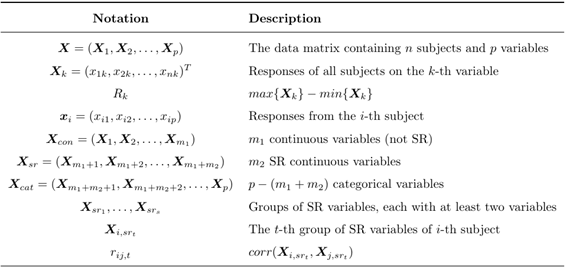

- **The Proposed Distance:** ([codes](Novel_Distance/Distance_Definition.R))

The distance between two subjects $x_i$ and $x_j$ is proposed as:

  

where:
- $\delta_{\text{cat}}(x_{ik}, x_{jk})$ is a co-occurrence-based distance [Ahmad and Dey, 2007](https://www.sciencedirect.com/science/article/abs/pii/S0169023X0700050X) for categorical variables.
- $w_t$ is the standard deviation of the lower triangular elements of the correlation distance matrix for the $t$-th group of self-reported (SR) variables, where the correlation distance is defined as $\sin\left( \frac{\arccos(r_{ij,t})}{2} \right)$

---

- **Selected Simulation Results:** ([codes](Novel_Distance/Simulation_Study.R))

The proposed distance achieves the highest ARI compared to all other distance metrics across all scenarios.

  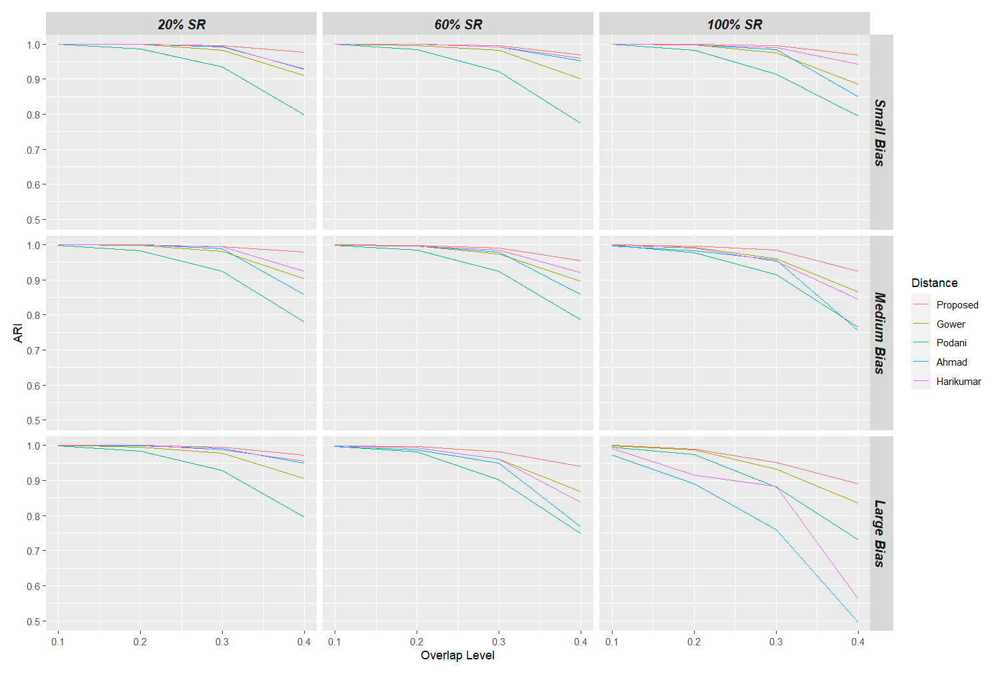

## Chronic Pain Patient Clustering by Accommodating Self-report Questionnaires and Interpretability
- **Objective:**
  - Cluster the CP patients based on the proposed questionnaire distance to capture the unique characteristics of the self-reported (SR) variables
  - Make clustering results more interpretable

- **Methods:**
  - Hierarchical clustering (HC) is employed with complete linkage, and the optimal number of clusters is determined by maximizing the Silhouette score
  - Interpretable Clustering via Optimal Trees (ICOT) [Bertsimas et al., 2021](https://link.springer.com/article/10.1007/S10994-020-05896-2) is applied to generate an interpretable clustering result with a tree structure ([codes](Interpretable_Clustering/icot.py))
  - The cluster center is computed for each cluster to represent its characteristics
  - Feature importance from the random forest model is used to evaluate the importance of each feature

- **ICOT Results:**

  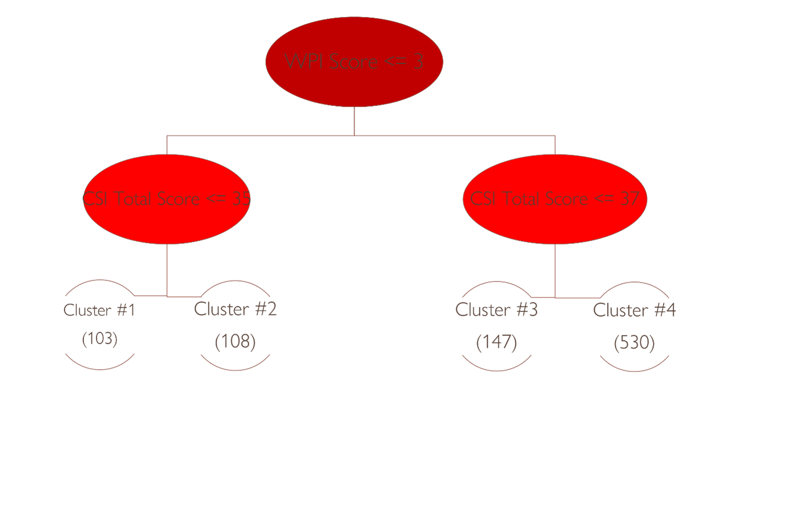

## Semi-supervised Clustering of Self-reported Data using Active Learning
- **Objective:**
  - Incorporate experts' domain knowledge into the clustering process to guide it toward better clustering results
  - Develop an active learning strategy to select the most informative subject pairs to query

- **Methods:**
  - Use the Metric Pairwise Constrained K-means (MPCK-means) framework [Basu et al., 2004](https://www.cs.utexas.edu/~ml/papers/semi-icml-wkshp-03.pdf) to incorporate the pairwise constraints (if two subjects should belong to the same cluster or not) into the clustering process ([codes](Semi_Supervised_Clustering/MPCKmeans_SR_notabs.py))
  - A two-step batch active learning framework was proposed to select multiple subject pairs to query at one time ([Step 1](Semi_Supervised_Clustering/Active_Query_Step1.py); [Step 2](Semi_Supervised_Clustering/Active_Query_Step2.py))
 
- **Selected Simulation Results:** ([codes](Semi_Supervised_Clustering/Simulate_Data.py))

The two proposed methods outperform the other four methods in most scenarios, especially when the proportion of SR variables is high.

  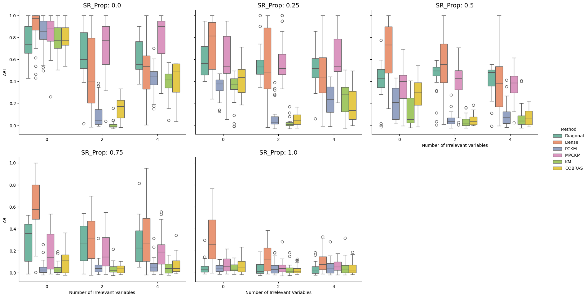

## Clinical Characteristics of Myofascial Trigger Points
- **Objective:**
  - Identify key MTrP characteristics crucial for clinical diagnosis and research  
  - Investigate the correlations among MTrPs, pain-pressure thresholds (PPT), and the Michigan Body Map

- **Methods:**
  - The canonical correlation analysis (CCA) is used to investigate the relationships among the three sets of variables ([codes](TriggerPoint/TPDA.R))

- **Results:**
  - The correlation coefficient between the first pair of canonical variates is 0.421, suggesting a moderate negative correlation between the Michigan Body Map and PPT 
  - The following two plots show the weights of variables for the first pair of canonical variates:

 

  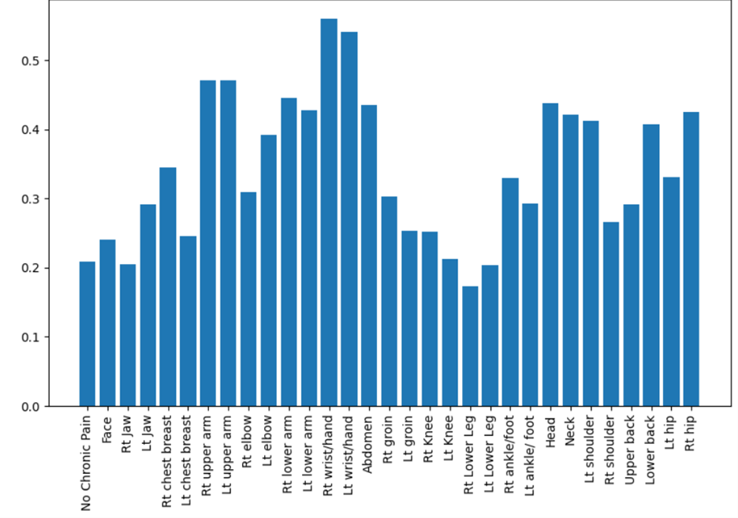
  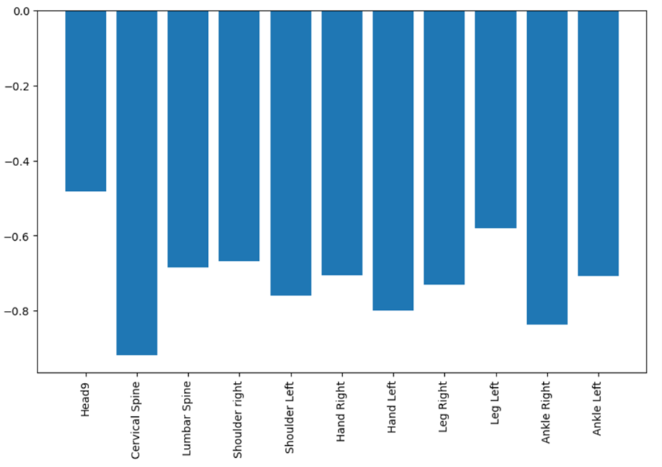

 

## Clinical Prediction of Nociplastic Pain using Combined Criteria

- **Objective:**
  - Assess the predictive ability of Michigan Pain Diagram (MPD), Central Sensitization Inventory (CSI), and Pain-Pressure Thresholds (PPT) for diagnosing nociplastic pain
  - Identify optimal threshold values for those variables to establish simple diagnostic rules

- **EDA and Data Pre-processing:** ([codes](Nociplastic_Prediction/Scatter_Matrix.ipynb))

Apply logarithmic transformations to the right-skewed predictors to reduce the influence of extreme values and improve symmetry.

  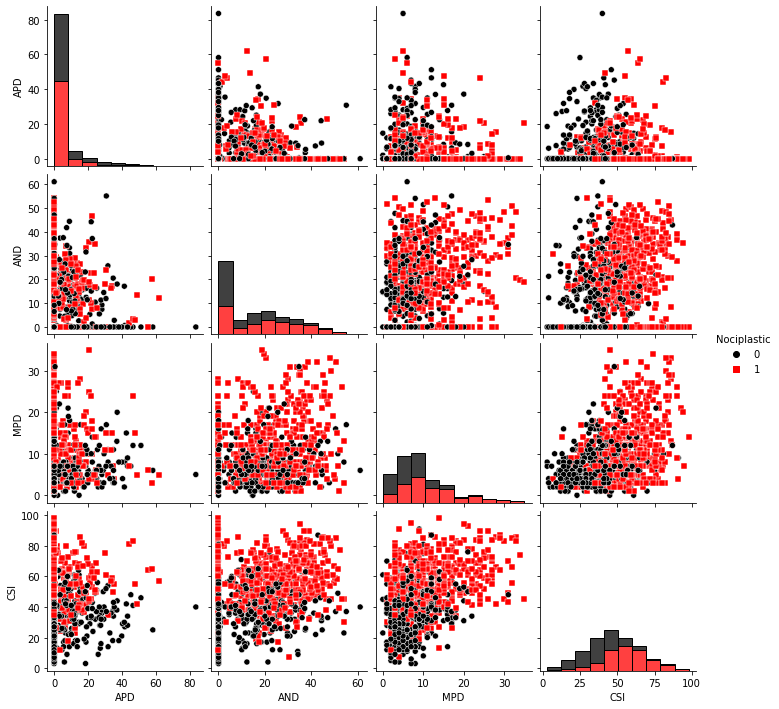
  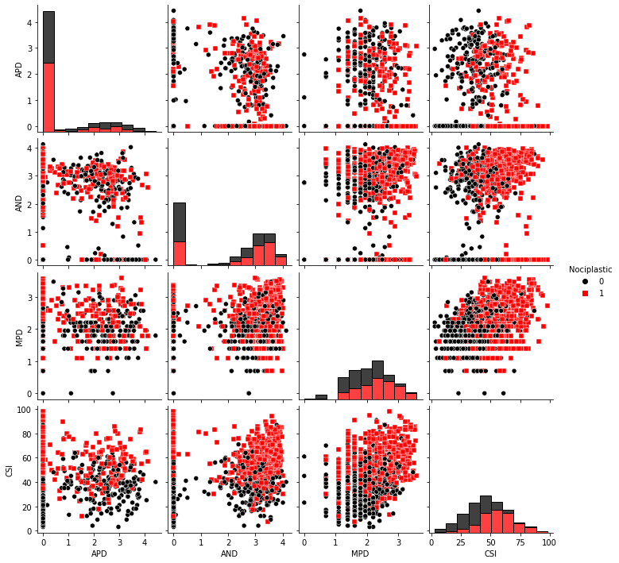

- **Methods:** ([codes](Nociplastic_Prediction/Nocioplastic_Prediction.R))
  - Three prediction models are considered: logistic regression, random forest (RF), and support vector machine (SVM). The data is randomly split into 70% for training and 30% for testing. This train/test split is repeated 100 times, and the models are evaluated based on the mean prediction accuracy on the test data
  - Use the best prediction model to determine the optimal cutoff for each predictor that yields the highest mean prediction accuracy

- **Results:**
  - In the SVM model, the Central Sensitization Inventory (CSI) accounts for 73.9% of the predictive power, while the Maximum Pain Duration (MPD) contributes 26.1%
  - Prediction accuracy is primarily driven by variations in the CSI cutoff, whereas changes to the MPD cutoff have a relatively minor impact
  - The optimal CSI threshold lies between 40 and 48. We recommend using two cutoffs—40 and 48—to classify patients into three distinct groups

  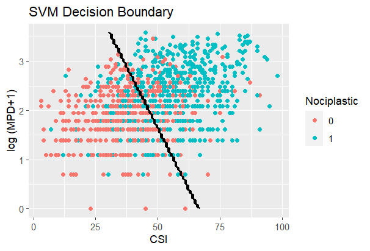
  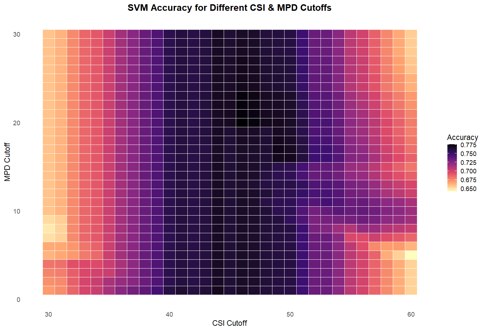

# Other Projects

## Predict Default Rate using Deep Learning ([codes](Default_Satellite/Coursework.ipynb))
This project developed a multimodal deep learning model to predict credit risk using both satellite images and structured data. For the unstructured data, the ResNet152 network [He et al., 2015](https://arxiv.org/abs/1512.03385) was employed. Its output was flattened and passed through two dense layers with ReLU activation and a dropout rate of 0.5 to prevent overfitting. A final dense layer with a sigmoid activation function was used to predict the probability of default.

The model was trained using the Adam optimizer with an initial learning rate of 1e-5 and a decay rate of 1e-6 at each epoch.

For the structured data, we used two dense layers with a dropout rate of 0.5: the first with 8 neurons and the second with 4 neurons.

The overall model architecture is illustrated below:

  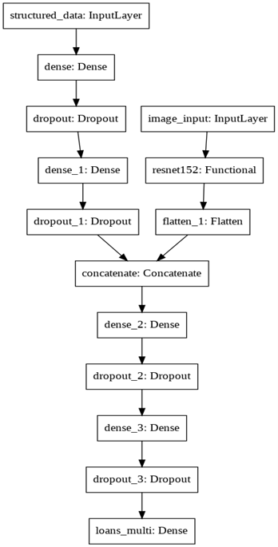

The training loss and validation loss in the training process are shown in the following figure:

  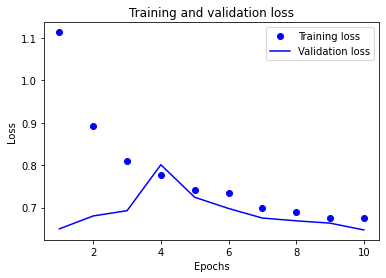

Finally, we evaluate the model's performance on the test data, obtaining an AUC of 0.7996, which indicates strong predictive power.

## Chronic Kidney Disease Detection
The analysis of this [dataset](https://www.kidney.org/kidney-topics/chronic-kidney-disease-ckd) has two main purposes. The first one is to build a chronic kidney disease detector to help hospitals diagnose *ckd* for patients. The other one is to find out which covariate has significant relationship with *ckd* and give patients health advice to protect them from *ckd*.

The details of this project are summarized in this [report](Kidney_Disease/SS9864_Final_Project.pdf), and the corresponding analysis script can be found [here](Kidney_Disease/9864_Final_Project.R).

